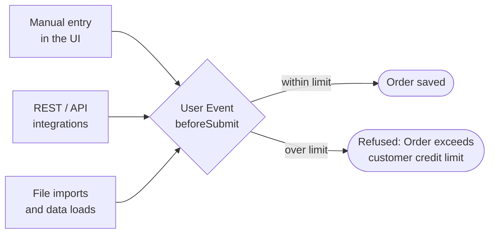

# NetSuite (SuiteScript 2.1, SDF project)

  

Every entry path goes through the same check, because it lives in a User Event script rather than in a screen.

| File | What it is |
|---|---|
| `src/FileCabinet/SuiteScripts/aidv/aidv_credit_lib.js` | Shared: open-order total (SuiteQL), credit terms, `exceedsLimit` |
| `src/FileCabinet/SuiteScripts/aidv/aidv_credit_limit_ue.js` | User Event `beforeSubmit` on Sales Order: hard block in every execution context |
| `src/FileCabinet/SuiteScripts/aidv/aidv_open_orders_sl.js` | Suitelet report: open orders by customer with credit headroom, date filter |
| `src/Objects/*.xml` | SDF script + deployment definitions |
| [`shopify-erp-order-sync` › `netsuite.js`](https://github.com/Milo-ai-HQ/shopify-erp-order-sync/blob/main/src/adapters/netsuite.js) | REST: SuiteQL lookups, then upsert `salesOrder/eid:<id>` |

Deploy: `suitecloud project:deploy` from `src/`.

---

## The same scenario, other platforms

Open orders by customer, a hard credit-limit block, and a Shopify order feed — built natively on each ERP:

- [Priority — Credit Control](https://github.com/Milo-ai-HQ/priority-credit-control)
- [Priority — Order Load Interface](https://github.com/Milo-ai-HQ/priority-order-load-interface)
- [Business Central — Sales Controls](https://github.com/Milo-ai-HQ/business-central-sales-controls)
- [Odoo — Sales Controls](https://github.com/Milo-ai-HQ/odoo-sales-controls)
- [Shopify → ERP Order Sync](https://github.com/Milo-ai-HQ/shopify-erp-order-sync)
